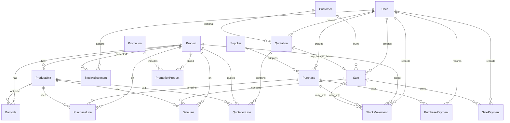
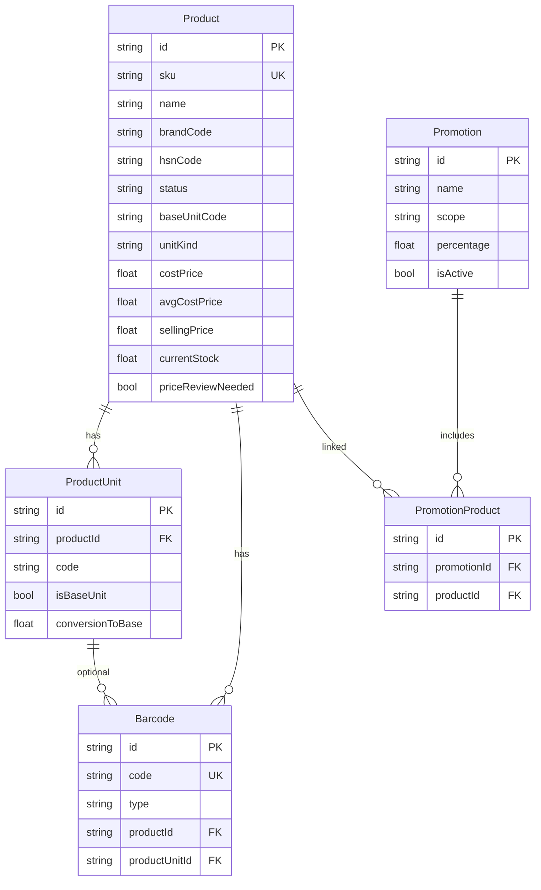
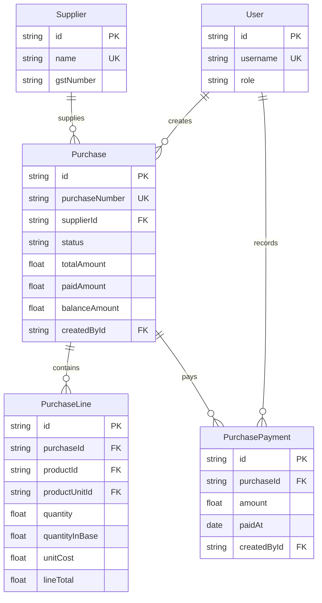
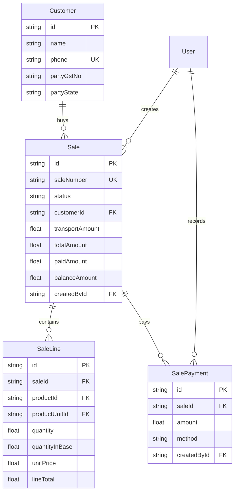
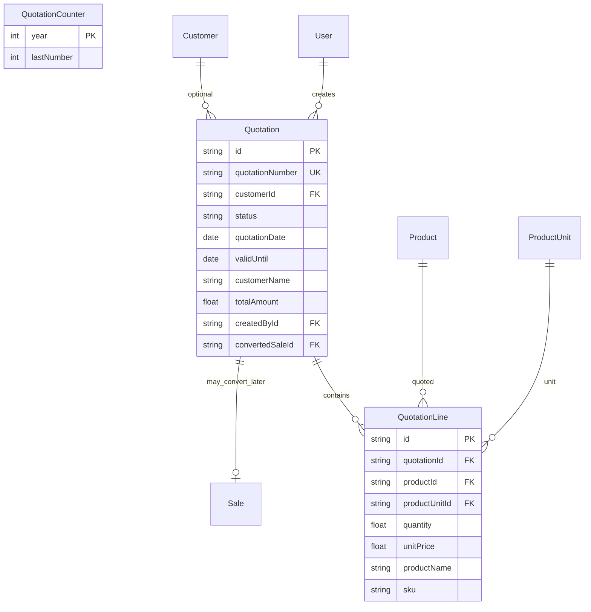
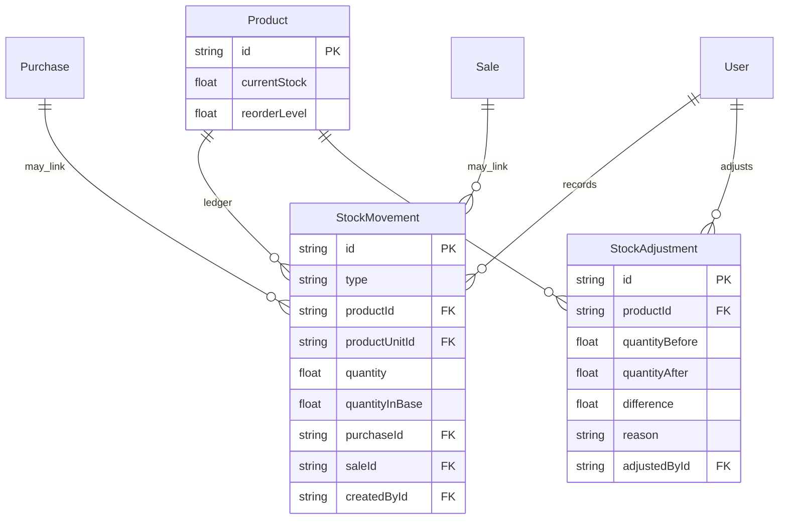
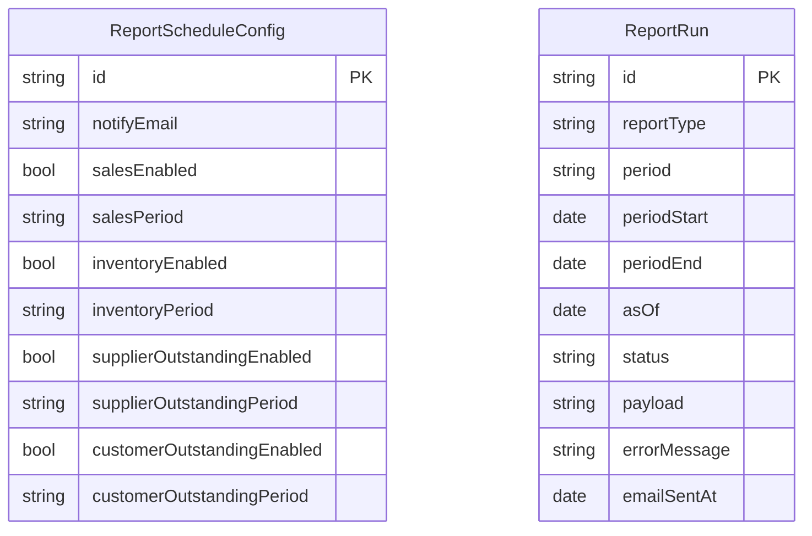

# ER Diagrams

**Product:** Hardware Inventory System  
**Source of truth:** [`prisma/schema.prisma`](../prisma/schema.prisma)  
**Version:** 1.0  
**Date:** 2026-07-24  
**Related docs:** [DATA_DICTIONARY.md](./DATA_DICTIONARY.md) (fields & enums), [FSD.md](./FSD.md) §8

Visual entity-relationship views of the PostgreSQL schema. Field-level definitions live in the data dictionary — diagrams here show structure and key attributes only.

**Mermaid note:** Unique keys are labeled `UK` (Mermaid’s unique-key marker). Types in diagrams are simplified (`string`, `float`, `bool`, `date`) for renderer compatibility; see the data dictionary for exact Prisma/`Decimal` types.

---

## 1. High-level relationships



---

## 2. Catalog domain



---

## 3. Purchasing domain



---

## 4. Sales domain



---

## 4a. Quotation domain

Quotations reference the existing product and an optional customer. They do not create stock movements. `convertedSaleId` points at the normal sale created when the quotation is converted (one sale per quotation).



---

## 5. Stock domain



---

## 6. Scheduled reports domain



`ReportScheduleConfig` is a singleton row with `id = "default"`. `ReportRun` rows are independent history (no FK between them); uniqueness is `(reportType, period, periodStart)`.

---

## Maintenance

- Update diagrams when relationships or key identifying fields change in `prisma/schema.prisma`.
- Keep field lists in sync via [DATA_DICTIONARY.md](./DATA_DICTIONARY.md).
- Regenerate Word/PDF:

```powershell
powershell -NoProfile -ExecutionPolicy Bypass -File scripts/export-doc.ps1 -DocName ER_DIAGRAMS -Title "Hardware Inventory - ER Diagrams"
```

---

*End of ER Diagrams.*
