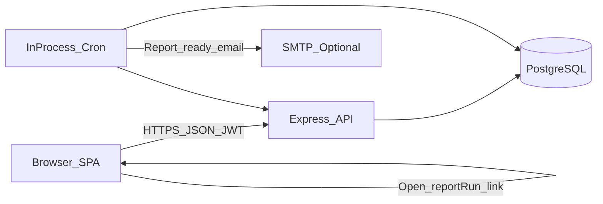
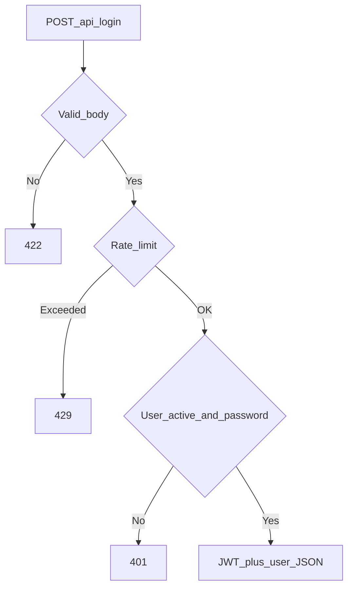
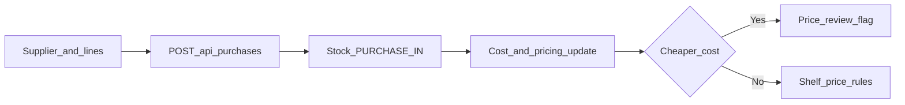
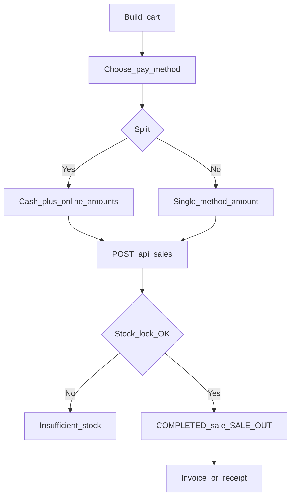
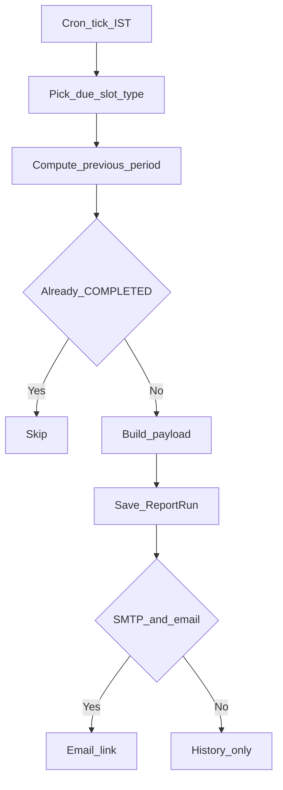
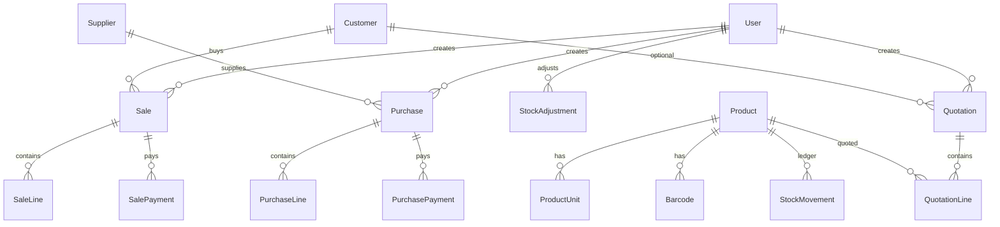

# Functional Specification Document (FSD)

**Product:** Hardware Inventory System  
**Document type:** Functional Specification (design of behavior)  
**Audience:** Developers (primary); owners/managers for flows and business rules  
**Version:** 1.0  
**Date:** 2026-07-24  
**Related docs:** [FRD.md](./FRD.md) (requirements), [DATA_DICTIONARY.md](./DATA_DICTIONARY.md) (schema), [ER_DIAGRAMS.md](./ER_DIAGRAMS.md) (ER), [USER_GUIDE.md](./USER_GUIDE.md), [packaging/GO-LIVE-NOTES.md](../packaging/GO-LIVE-NOTES.md), [packaging/README.md](../packaging/README.md)

This FSD describes **how** the as-built system fulfills the FRD: architecture, flows, business rules, UI surfaces, and API surface. It is not a pixel-level UI kit or full OpenAPI spec.

---

## 1. Document control

| Item | Value |
|------|--------|
| Requirements source | `docs/FRD.md` |
| Implementation truth | `prisma/schema.prisma`, `src/`, `frontend/src/` |
| Auth note | Live model is **JWT + RBAC**. Ignore any older “no JWT” notes in AI context docs. |

---

## 2. System context

| Layer | Technology |
|-------|------------|
| Frontend | React 19, TypeScript, Vite 6; inline styles; no UI kit |
| Backend | Node ≥20, Express 5, Zod validation, `tsx` |
| Database | PostgreSQL via Prisma 7 (`@prisma/adapter-pg`) |
| Auth | Username/password → JWT Bearer; bcrypt password hashes |
| Jobs | `node-cron` in API process (`Asia/Kolkata`) |
| Email | Optional Nodemailer SMTP for scheduled reports |

---

## 3. Architecture overview

- **`buildApp()`** (`src/app.ts`) mounts `/api/login`, `/api/health`, then JWT `actingUserMiddleware` on `/api/*`, then domain routers.
- Production may set `SERVE_FRONTEND=1` so Express serves `frontend/dist` and SPA fallback for non-API GETs.
- Validation schemas live in `src/validation/schemas.ts`.
- Inventory/pricing/report logic lives under `src/services/` and `src/lib/`.
- Frontend API client: `frontend/src/api/client.ts` (Authorization + optional `X-Acting-User-Id`).

---

## 4. Auth and RBAC

**FR:** FR-AUTH-*, role matrix §7 in FRD.

### 4.1 Login flow

- Route: `POST /api/login` (no Bearer required).
- Success: access token + user profile; client stores token (localStorage; ~7-day JWT lifetime per env/docs).
- Rate limit: `LOGIN_RATE_LIMIT_MAX` / `LOGIN_RATE_LIMIT_WINDOW_MS` (default 10 / 15 min).

### 4.2 Acting user

- Middleware: `src/middleware/actingUser.ts`.
- Requires `Authorization: Bearer <token>`.
- Optional header `X-Acting-User-Id`: only if JWT user has admin access (`ADMIN` or `MANAGER`); switches `req.actingUser`.
- `hasAdminAccess(role)` treats `MANAGER` as admin for compatibility.
- `requireAdmin` middleware gates back-office routes.

### 4.3 Session API

- `GET /api/session` — current JWT user, acting user, and (for admin) list of users available for acting-as switcher.

---

## 5. Information architecture

**Source:** `frontend/src/Sidebar.tsx`, `frontend/src/App.tsx`, `frontend/src/featureFlags.ts`.

| Tab id | Label | Component | Visibility |
|--------|-------|-----------|------------|
| `home` | Home | `HomeView` | All |
| `pos` | Sell (POS) | `POSView` (in App) | All |
| `outstanding` | Outstanding | `OutstandingView` | All |
| `invoices` | Invoices | `ReprintInvoicePage` | All |
| `quotations` | Quotations | `QuotationsPage` | Admin |
| `reporting` | Reporting | `ReportingPage` (+ `SavedReportViewer`) | Admin + `FEATURE_FLAGS.reporting` |
| `products` | Products | `ProductsPage` | All (mutations admin only) |
| `promotion` | Promotions | `PromotionsPage` | Admin + `catalogPromotions` (default **off**) |
| `inventory` | Overview | `InventoryView` | All |
| `purchase` | Purchases | `PurchaseView` | Admin |
| `adjustment` | Adjustments | `AdjustmentView` | Admin |
| `settings` | Settings | `SettingsPage` | All |

Unauthenticated → `LoginPage`. Soft redirect to Home if a cashier hits admin-only tabs. Deep link `?reportRun=<id>` opens Reporting for admin when reporting is enabled.

**Current feature flags:** `reporting: true`; `catalogPromotions: false`; other catalog/inventory sub-flags `false`.

---

## 6. Module functional design

### 6.1 Home

**FR:** FR-HOME-*

| Aspect | Design |
|--------|--------|
| Goals | Orient staff; jump to POS/inventory; show alerts and (admin) revenue |
| UI | Shortcuts, recent activity, stock alert counts, admin charts via report timeseries APIs |
| APIs used | Sales recent-activity; report dashboard/revenue series (admin); products for alert counts |
| Edges | Cashier UI emphasizes sell path; charts may be empty on fresh installs |

---

### 6.2 Catalog (products)

**FR:** FR-CAT-*

#### Business rules

- Product has base unit + optional additional `ProductUnit` rows with `conversionToBase`.
- `Barcode.code` unique; types PRODUCT / PACK / INTERNAL / SUPPLIER.
- `brandCode` unique case-insensitively when non-blank; blank may auto-generate `BC-#####`.
- Stock on hand: `Product.currentStock` (base units); ledger via `StockMovement`.
- **Price review:** cheaper purchase → keep `sellingPrice`, set `priceReviewNeeded`, `suggestedSellingPrice`, `priceReviewNote`. Cost increase → selling may rise via markup (`src/lib/productPricing.ts` / purchase receive path). Admin apply/dismiss per product or all.
- GST fields: `hsnCode`, `cgstPercent` / `sgstPercent` / `igstPercent`.
- Status ACTIVE / INACTIVE.
- Product search matches name, SKU, category, brand, brand code, color, size, HSN, and barcode.

#### UI surfaces

- Products grid: paginated (50), server search; some columns hidden in grid but present in forms/import.
- Add/edit, batch entry, CSV/Excel import (≤ ~1500), download template.
- Price review banner: Apply / Keep current (per item and bulk).

#### API (`/api/products`)

| Method | Path | Auth |
|--------|------|------|
| GET | `/` | Authenticated (list/search/paging) |
| GET | `/:id/stock` | Authenticated |
| POST | `/batch` | Admin |
| PATCH | `/:id` | Admin |
| DELETE | `/:id` | Admin |
| POST | `/price-review/apply-all` | Admin |
| POST | `/price-review/dismiss-all` | Admin |
| POST | `/:id/price-review/apply` | Admin |
| POST | `/:id/price-review/dismiss` | Admin |

#### Edges

- Delete may fail if product is referenced by historical lines (constraint/error handling as implemented).
- Bulk create uses chunked transactions (~100/chunk).

---

### 6.3 Parties (suppliers and customers)

**FR:** FR-PARTY-*

| Entity | API | Notes |
|--------|-----|-------|
| Supplier | `GET/POST /api/suppliers` — **admin router** | Unique name; used by purchases |
| Customer | `GET /`, `GET /:id`, `POST /` under `/api/customers` — authenticated | Optional `partyGstNo`, `partyState`; phone unique when set |

UI: supplier management primarily on Purchases screen; customers used from POS / outstanding / reports.

---

### 6.4 Purchases

**FR:** FR-PUR-*

#### Business rules

- Status enum: DRAFT / RECEIVED / CANCELLED (create path records received stock as implemented in purchase service).
- Unique `purchaseNumber`; rare collisions retried.
- Lines: quantity in selected unit → `quantityInBase`; unit cost drives catalog cost / avg cost / selling rules.
- Payments: `POST /api/purchases/:id/payments` updates `paidAmount` / `balanceAmount`.
- Import: match by brand code and/or product name; optional single supplier column; >40 lines → summary UI before Record Purchase.

#### API (`/api/purchases`) — all admin

| Method | Path |
|--------|------|
| GET | `/` |
| POST | `/` |
| GET | `/:id` |
| POST | `/:id/payments` |

#### Edges

- Cashier: 403 / nav hidden.
- Large imports need `JSON_BODY_LIMIT` (default 15mb).

---

### 6.5 Point of sale (POS)

**FR:** FR-POS-*

#### Business rules

- Sale statuses: DRAFT / COMPLETED / CANCELLED / RETURNED (POS complete path produces completed sales with movements). Cancelling a completed invoice is an admin action on Invoices (§6.7): status becomes `CANCELLED` and stock is restored with `SALE_RETURN_IN`. The sale row is not deleted.
- Payments: `SalePaymentMethod` CASH | ONLINE_BANKING; multiple payments allowed over time.
- Split: cash + online entered separately; **remainder = balance due** (not auto-assigned).
- Totals: subtotal, discount, tax, `transportAmount`, total, paid, balance.
- Customer: walk-in fields and/or `customerId`; snapshots for name/GST/state on the sale.
- Document numbers: `BIL-{n}` vs `INV-{n}` from `src/lib/documentNumbers.ts`; starts via `SALE_NUMBER_BILL_START` / `SALE_NUMBER_TAX_START`.
- Concurrent completion uses stock locking so oversell is rejected.

#### UI

- Product search/cart, discounts, payment panel, processing indicator on long confirms, invoice print integration (`frontend/src/invoice/`).
- The **Tax invoice** checkbox is checked by default (`POS_TAX_INVOICE_DEFAULT` in `frontend/src/App.tsx`), so new sales are `documentKind: "tax_invoice"` (`INV-*`) unless the cashier unchecks it for a plain bill (`BIL-*`). **Clear all** and completing a sale return it to checked. An unchecked box counts as a draft change, so **Clear all** shows to restore it.

#### API (`/api/sales`) — authenticated (no admin gate, except cancel)

`POST /:id/cancel` is admin-only. See §6.7.

| Method | Path |
|--------|------|
| POST | `/` (create/complete sale as validated) |
| GET | `/recent-activity` |
| GET | `/outstanding` |
| GET | `/search` |
| GET | `/by-number/:saleNumber` |
| GET | `/:id` |
| POST | `/:id/payments` |
| POST | `/:id/cancel` (admin; §6.7) |

#### Edges

- Insufficient stock → error to client naming every short product with needed and available quantity; cart may be retried with reduced qty.
- Body `createdById` must match acting user where enforced.

---

### 6.6 Outstanding

**FR:** FR-OUT-*

| Aspect | Design |
|--------|--------|
| UI | `OutstandingView` — list sales with `balanceAmount` > 0; record payment |
| API | `GET /api/sales/outstanding`; `POST /api/sales/:id/payments` |
| Rules | Payments append `SalePayment` rows; update paid/balance |

---

### 6.7 Invoices (reprint)

**FR:** FR-INV-*

| Aspect | Design |
|--------|--------|
| UI | `ReprintInvoicePage` — lists at least the 10 most recent completed or cancelled invoices, plus search/lookup by sale number. Print layout from the invoice module. Each row has **Invoice**. Admin/Manager also see **Cancel** beside it when `status` is `COMPLETED`. |
| API | `GET /api/sales/recent` (default 10, minimum 10), `GET /api/sales/search`, `GET /api/sales/by-number/:saleNumber`, `GET /api/sales/:id`, `POST /api/sales/:id/cancel` (admin) |
| Branding | UI strings: `frontend/src/lib/branding.ts` (`VITE_COMPANY_NAME`); invoice letterhead fields in `frontend/src/invoice/invoiceBranding.ts` |

- `INV-*` tax invoices use a boxed GST print layout with header copy label, party/invoice detail panels, HSN tax summary, and footer terms/bank/signatory blocks. `BIL-*` bills and quotations keep their existing print documents.
- The tax invoice party box may include the linked customer address when the sale is tied to a registered customer. Reprint data now exposes that address on the sale detail payload for invoice rendering.

#### Cancel a completed invoice

- Confirmation (existing `ConfirmModal`) before any request. Title: `Cancel invoice {saleNumber}?`. Message: the invoice will be cancelled, items restored to inventory, and the action cannot be undone. Buttons: **Keep Invoice** (dismiss) and **Cancel Invoice** (confirm).
- `POST /api/sales/:id/cancel` requires admin (`ADMIN` or `MANAGER`). No request body. The signed-in user is recorded on the stock movements.
- Eligible status is `COMPLETED` only. `CANCELLED`, `RETURNED`, and `DRAFT` are rejected. The sale, its lines, and its payments are not deleted. `status` is set to `CANCELLED`.
- In the same database transaction, each sale line posts a `SALE_RETURN_IN` movement and `Product.currentStock` increases by that line’s `quantityInBase` (lines for the same product are summed). Product rows are locked the same way as a sale (`SELECT … FOR UPDATE`). The sale row is locked first so a second cancel cannot restore stock twice.
- Search (`GET /api/sales/search`) returns `COMPLETED` and `CANCELLED` sales, including `status`, so a cancelled invoice stays on the list. `DRAFT` and `RETURNED` are not added to this list.
- After success the row stays. **Cancel** is replaced by a non-clickable **Cancelled** label. **Invoice** still opens the document, which shows a cancelled mark. Success text: `Invoice {saleNumber} cancelled and inventory restored.`
- Outstanding, recent activity, and sales reports continue to use `COMPLETED` only, so a cancelled invoice drops out of those lists. Payment rows stay on the sale as history; this action does not post a cash refund.

---

### 6.8 Stock overview and adjustments

**FR:** FR-STK-*

| Aspect | Design |
|--------|--------|
| Overview UI | `InventoryView` — table columns SKU, Product, Category, Color, Sale Price, Stock, Unit, Status (each sortable; products without a colour always sort last), summary cards, search, category filter; in/low/out status vs reorder |
| Adjustment UI | `AdjustmentView` — product, target/delta as implemented, reason, note |
| API | Adjust: `POST /api/stock-adjustments` (admin). Stock read also via products. |
| Rules | `StockAdjustment` stores before/after/difference; movements ADJUSTMENT_IN/OUT, DAMAGE_OUT, etc. as typed |
| Edges | Cashiers see overview only |

---

### 6.8a Quotations

**FR:** FR-QUO-*

Admin/Manager commercial documents. A quotation is not a sale until it is converted (see **Convert to sale** below).

#### Business rules

- Lines reference `Product.id` and an optional `ProductUnit`. Unit price is `sellingPrice × conversionToBase`. The API rejects a submitted unit price, line tax, or document totals and recalculates them.
- `includeGst` defaults to true. When it is true, GST uses the product `cgstPercent` / `sgstPercent` / `igstPercent` the same way as a tax invoice: discount is removed first, each component is rounded to paise, transport is added after tax and is not taxed. When it is false, the quotation is priced like a non-tax bill: line tax and header CGST/SGST/IGST are 0, and the total is subtotal − discount + transport. Product GST percentages are still snapshotted on the line and are not charged. The saved flag is the source of truth, so a later product-rate change does not add GST until a draft is edited with Include GST turned on. An order discount percent is allocated across lines (remainder on the last line), in addition to any per-line rupee discount.
- Customer may be an existing `Customer` (`customerId` set) or a one-off party (`customerId` null). The quotation stores its own name, contact person, phone, email, address, GSTIN, and state snapshot. Optional save-as-customer creates a `Customer` or links an existing phone; it does not overwrite that customer.
- Number `QUO-YYYY-####` comes from `QuotationCounter`, locked with `SELECT … FOR UPDATE` in the create transaction. `quotationDate` is the Asia/Kolkata calendar date; `validUntil` is that date plus 2 days. Issuing a draft refreshes those dates. `EXPIRED` is not stored: an `ISSUED` row is shown as expired when today’s India date is after `validUntil`.
- Drafts can be edited. Issued rows cannot. Cancelled rows cannot be issued. Creating, editing, issuing, and cancelling never write `Sale`, `SalePayment`, `StockMovement`, or `Product.currentStock`; only **Convert to sale** does, through the normal sale path.
- `convertedSaleId` (unique) points at the sale created from the quotation. `CONVERTED` is derived, like `EXPIRED`: an `ISSUED` row with `convertedSaleId` set. A converted quotation cannot be converted again or cancelled (cancel the sale from Invoices). Cancelling that sale does not reopen the quotation.

#### Convert to sale

- Admin only. Button on `ISSUED` and `EXPIRED` quotations (list and view). `EXPIRED` asks for confirmation first; quoted prices still apply.
- The page fetches the quotation (`GET /api/quotations/:id`) and hands it to the POS (`App` holds it in `quotationToConvert`; `POSView` loads it once). The cart is built by `frontend/src/lib/quotationConversion.ts` (`buildConversionCart`): quoted price per quoted unit, quantity, GST rates, and per-line quoted discount/tax (`CartLine.quote`). Customer: the registered customer if `customerId` is set, otherwise name, phone, GSTIN, and state go into the walk-in fields. Transport is carried over. Lines whose product or unit no longer exists are listed as not added.
- In the POS the **Tax invoice** box is locked to the quotation (`includeGst` true gives a tax invoice `INV-*`, false gives a bill `BIL-*`), the discount and promotion inputs are replaced by a read-only **Quotation discount**, other products cannot be added, a line quantity cannot exceed the quoted quantity, and lines can be lowered or removed. For a quantity below the quoted one, the quoted line discount is pro-rated and GST is recalculated on the discounted amount (`computePosTotals`, `PosCartLineInput.quote`); at the full quoted quantity the quoted discount and tax are kept exactly. Everything else (customer rules, payment methods, split payment, below-cost warning) is the normal POS checkout.
- Lines asking for more than the stock are shown with their shortfall and **Confirm Sale** is blocked until they are lowered or removed.
- Submit: `POST /api/sales` with `quotationId` and, on every line, `quotationLineId`. `createSale` locks the quotation row (`SELECT … FOR UPDATE`) and `assertConversionAllowed` (`src/lib/quotationConversion.ts`) checks: the quotation is `ISSUED` and not converted; `documentKind` matches `includeGst`; every line is a distinct line of that quotation with the same product and unit; the unit price equals the quoted price; the quantity does not exceed the quoted quantity; the discount does not exceed the quoted line discount pro-rated to the quantity (1 paisa tolerance); no tax when `includeGst` is false. The route returns 403 for non-admins. All short products are collected and reported together (`Insufficient stock for A (need n, have m), B (…)`). In the same transaction the sale is created (its note ends with `Converted from QUO-…`) and `Quotation.convertedSaleId` is set.

#### UI

- Sidebar **Quotations** (admin). List with number/customer search, customer, status, and date filters.
- Editor: existing or new customer, product search (name, SKU, barcode), unit, quantity, read-only selling price, line discount, **Include GST** (on by default), order discount %, transport, note. Save draft or issue. Turning Include GST off zeroes the live tax lines.
- View/print reuses the invoice letterhead (`QuotationDocument`). Download uses `GET /api/quotations/:id/pdf`.

#### API (`/api/quotations`) — `requireAdmin`

| Method | Path |
|--------|------|
| POST | `/` |
| GET | `/` |
| GET | `/:id` |
| PATCH | `/:id` (draft only) |
| POST | `/:id/issue` |
| POST | `/:id/cancel` |
| GET | `/:id/pdf` |

#### Edges

- Cashier: 403. Missing selling price, inactive product, bad quantity/unit, or discount above the line amount: 400/422.
- Listing: `status` accepts `DRAFT`, `ISSUED`, `EXPIRED`, `CONVERTED`, `CANCELLED`. `ISSUED` and `EXPIRED` exclude converted rows. List and detail include `convertedSaleNumber`; detail also has `convertedSaleId`.
- Issuing reprices from the current selling price, keeping the saved line discounts and `includeGst`. When `includeGst` is false, refreshed product GST rates may be snapshotted but are not charged.

---

### 6.9 On-demand reporting

**FR:** FR-RPT-*

All under `/api/reports`, **admin only**.

| Method | Path | Query |
|--------|------|-------|
| GET | `/sales-summary` | `from`, `to` (YYYY-MM-DD) |
| GET | `/tax-invoice-sales` | from, to |
| GET | `/sales-by-product` | from, to |
| GET | `/sales-by-customer` | from, to |
| GET | `/supplier-payments` | from, to |
| GET | `/purchases` | from, to |
| GET | `/gross-margin` | from, to |
| GET | `/dashboard-timeseries` | `days` (default 14) |
| GET | `/sales-revenue-series` | `granularity` day\|week\|month; `buckets` |

UI: `ReportingPage` — pick report and date range; charts for series endpoints. Indexes on sale/purchase `createdAt` support range queries.

---

### 6.10 Scheduled owner reports

**FR:** FR-SCH-*

#### Configuration

Singleton `ReportScheduleConfig` id=`default`:

- `notifyEmail` (required if any type enabled)
- Per type: enabled + period (`DAILY` | `MONTHLY` | `QUARTERLY` | `YEARLY`)
- Types: Sales, Inventory, Supplier outstanding, Customer outstanding

#### Payload content

| Type | Content |
|------|---------|
| SALES | Sales summary + gross margin for period |
| INVENTORY | Active product stock snapshot (value, OOS, below reorder) |
| SUPPLIER_OUTSTANDING | RECEIVED purchases with balance > 0, by supplier |
| CUSTOMER_OUTSTANDING | COMPLETED sales with balance > 0 |

Periods generate the **previous** completed window. Quarterly uses Indian FY (Q1 Apr–Jun … Q4 Jan–Mar).

#### Scheduler

- Files: `src/jobs/reportScheduler.ts`, `src/services/scheduledReports.ts`, `src/lib/reportScheduleSlots.ts`
- Enable: `REPORT_SCHEDULER_ENABLED=1|true`, or default **on** when `NODE_ENV=production`
- Cron: `REPORT_CRON_IST` default `0,30 6-8 * * *` Asia/Kolkata
- Stagger ~30 min: Sales → Inventory → Supplier → Customer; **one type per tick**
- Unique `(reportType, period, periodStart)`; retries failed/incomplete; skips completed

#### Email

- Requires `notifyEmail` + `SMTP_HOST` (and related SMTP_* vars)
- Link: `{APP_PUBLIC_URL}/?reportRun={id}`
- Without SMTP: run still COMPLETED in DB

#### API (`/api/scheduled-reports`) — admin

| Method | Path |
|--------|------|
| GET/PUT | `/config` |
| GET | `/runs?limit=` |
| GET | `/runs/:id` |

UI: Reporting → Scheduled owner reports; history; `SavedReportViewer` for a run.

---

### 6.11 Promotions (optional)

**FR:** FR-PROMO-01

- Schema: `Promotion` + `PromotionProduct`; scope CART / PRODUCT / CATEGORY; percentage discount; optional date window.
- API: `GET /api/promotions` (auth); `POST`/`PUT`/`DELETE` admin.
- UI: hidden unless `FEATURE_FLAGS.catalogPromotions === true` (default false).

---

### 6.12 Settings

**FR:** FR-SET-*

- `SettingsPage`: Light / Dark / System via `useTheme` — **browser local only**; no settings API.

---

## 7. Cross-cutting concerns

| Concern | Design |
|---------|--------|
| Validation | Zod schemas in `src/validation/schemas.ts`; 422 with field details on failure |
| Errors | Central `errorHandler`; domain errors return JSON `{ error }` (+ details) |
| CORS | `buildCorsOptions()`; production uses `CORS_ORIGIN` list |
| Body size | `JSON_BODY_LIMIT` default `15mb` for bulk imports |
| Feature flags | `frontend/src/featureFlags.ts` — compile-time constants |
| Document numbers | Sale series via env starts; quotation series `QUO-YYYY-####` via `QuotationCounter` |
| Branding | `VITE_COMPANY_NAME` / short name; invoice static letterhead module |
| Acting user audit | Sale/purchase/adjustment creator IDs must align with acting user checks |

---

## 8. Data model summary

Full field-level dictionary: **[`docs/DATA_DICTIONARY.md`](./DATA_DICTIONARY.md)**.  
ER diagrams: **[`docs/ER_DIAGRAMS.md`](./ER_DIAGRAMS.md)**. Source schema: `prisma/schema.prisma`.

Primary entities:

| Entity | Role |
|--------|------|
| User | Staff; role ADMIN/MANAGER/CASHIER; `passwordHash` |
| Product | Catalog + `currentStock`, costs, MRP, selling, GST, price review |
| ProductUnit / Barcode | Sell/buy units and scan codes |
| Supplier / Customer | Parties |
| Purchase / PurchaseLine / PurchasePayment | Stock in + payables |
| Sale / SaleLine / SalePayment | Stock out + receivables |
| Quotation / QuotationLine | Commercial quote; no stock movement until converted. `convertedSaleId` links the sale created by Convert to sale |
| StockMovement | Immutable-style ledger of qty changes |
| StockAdjustment | Explicit correction audit |
| Promotion* | Optional discounts |
| ReportScheduleConfig / ReportRun | Owner schedule + saved payloads |

---

## 9. Deployment modes (functional view)

| Mode | Behavior |
|------|----------|
| Dev API + Vite | API (e.g. :4000) + frontend (:5173); CORS allows local Vite origins |
| `npm run start:prod` | Built SPA served from Express when `SERVE_FRONTEND=1` / production dist present |
| Railway / hosted | See `packaging/RAILWAY.md`; same API + DB + env |
| Backups | `npm run db:backup` / restore — `scripts/BACKUP.md` |
| Health | `GET /api/health` unauthenticated |

Install steps are **not** duplicated here; see packaging docs.

---

## 10. FR → FSD index

| FR ID prefix | FSD |
|--------------|-----|
| FR-AUTH | §4 |
| FR-HOME | §6.1 |
| FR-CAT | §6.2 |
| FR-PARTY | §6.3 |
| FR-PUR | §6.4 |
| FR-POS | §6.5 |
| FR-OUT | §6.6 |
| FR-INV | §6.7 |
| FR-STK | §6.8 |
| FR-RPT | §6.9 |
| FR-SCH | §6.10 |
| FR-PROMO | §6.11 |
| FR-SET | §6.12 |
| FR-QUO | §6.8a |
| NFR-SEC / CON / PERF / OPS / OBS / I18N | §4, §7, §9 |

---

## 11. Known optional / disabled surfaces

Documented so requirements are not mistaken for missing defects:

| Item | Status |
|------|--------|
| Promotions nav/UI | Flag off by default |
| Catalog brands / product types / price books nav | Flags off |
| Inventory order / receive / supplier returns / counts nav | Flags off |
| Invoice company address/GST/bank | Code constants, not admin UI |
| Server-side user admin CRUD UI | Not a first-class module (seed/DB for users) |

---

*End of FSD. Requirements and acceptance criteria are in `docs/FRD.md`.*
