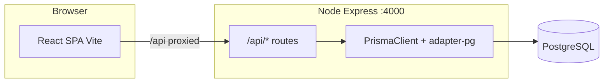

# Hardware Inventory System — project context (for AI assistants)

Use this document to understand the **Hardware Inventory System** codebase: purpose, architecture, how to run it, and where important logic lives.

---

## 1. What this project is

A **full-stack inventory and retail operations app** for a hardware store (or similar):

- **Catalog**: products with SKUs, units, barcodes, categories, pricing, stock on hand.
- **Purchasing**: purchases from suppliers, line items, stock increases when received.
- **Sales / POS**: draft and complete sales, line items, stock decreases.
- **Stock adjustments**: manual corrections with reasons (audit trail via `StockAdjustment` + movements).
- **Promotions**: discounts scoped to **cart** (optional code), **category**, or **specific products** (`Promotion`, `PromotionProduct`).
- **Suppliers**: CRUD-style API for supplier records.

The UI is a **single-page React app** with a sidebar; the API is **Express** on **Node** with **PostgreSQL** via **Prisma 7** (driver adapter: `@prisma/adapter-pg`).

---

## 2. Repository layout

| Path | Role |
|------|------|
| `src/server.ts` | Express app entry: mounts all `/api/*` routers, default port **4000**. |
| `src/routes/*.ts` | REST handlers (products, purchases, sales, session, stock-adjustments, suppliers, promotions). |
| `src/lib/prisma.ts` | Singleton `PrismaClient` with `PrismaPg` adapter; requires `DATABASE_URL`. |
| `src/middleware/validateBody.ts` | Zod body validation for POST routes. |
| `src/validation/schemas.ts` | Zod schemas (including batch product create, promotions). |
| `src/services/` | Domain logic (e.g. inventory/stock). |
| `prisma/schema.prisma` | Database models and enums. |
| `prisma/migrations/` | SQL migrations (apply with Prisma CLI). |
| `prisma/seed.ts` | Seeds users, suppliers, sample products, promotions. |
| `prisma.config.ts` | Prisma 7 config (schema path, migrations path, datasource URL from env). |
| `frontend/` | Vite + React 19 + TypeScript SPA. |
| `frontend/src/App.tsx` | Main shell: tab state, data loading, routes views by tab. |
| `frontend/src/api/client.ts` | `fetch` wrapper for all API calls. |
| `frontend/src/api/types.ts` | TypeScript shapes aligned with API JSON. |
| `frontend/src/api/errors.ts` | `ApiError`, `parseErrorResponse` (handles JSON errors and HTML error pages from Express). |
| `frontend/src/featureFlags.ts` | Boolean flags to show/hide sidebar sections (e.g. `catalogPromotions`). |

---

## 3. Tech stack

- **Backend**: Node.js, **Express 5**, **TypeScript** (run with `tsx`), **Zod** for validation, **CORS**, **dotenv**.
- **Database**: **PostgreSQL**, **Prisma ORM 7** with `@prisma/adapter-pg` and `pg`.
- **Frontend**: **React 19**, **Vite 6**, TypeScript.
- **No real login UI** in the described flow: see session model below.

---

## 4. Environment variables

| Variable | Where | Purpose |
|----------|--------|---------|
| `DATABASE_URL` | Root `.env` | PostgreSQL connection string (required by `src/lib/prisma.ts`). |
| `PORT` | Root (optional) | API port; default **4000**. |
| `VITE_API_URL` | Frontend (optional) | If set, API base URL for `fetch`; if empty, requests use same origin (typical dev: Vite proxy). |

---

## 5. How to run (development)

From **repository root**:

1. Ensure PostgreSQL is running and `DATABASE_URL` is set.
2. `npm install` (root) and `npm install` in `frontend/` if needed.
3. `npx prisma generate`
4. Apply migrations: `npx prisma migrate deploy` (or `migrate dev` during schema work).
5. Optional seed: `npm run seed` (creates ADMIN/CASHIER users and sample data).
6. **API**: `npm run dev` → `http://localhost:4000` (health: `GET /`).
7. **Web**: `npm run dev --prefix frontend` (or `npm run dev:web` from root) → typically **5173**, with Vite **proxying `/api` → `http://localhost:4000`**.

**Important**: If the API returns HTML `Cannot GET /api/...`, the process on port 4000 may be an **old build** without newer routes. **Restart** the API after pulling changes; on Windows, check nothing else is bound to port 4000.

---

## 6. HTTP API surface (high level)

Base path for routers is under **`/api`** (see `src/server.ts`):

| Mount | Typical operations |
|-------|---------------------|
| `/api/session` | `GET /` — returns `{ adminUserId, cashierUserId }` from first active ADMIN and CASHIER (dev convenience). |
| `/api/products` | List/create products; includes related units and barcodes; batch create supported. |
| `/api/suppliers` | Supplier CRUD-style endpoints. |
| `/api/purchases` | Purchase workflow (draft/receive, lines, ties to inventory). |
| `/api/sales` | Sales / POS workflow (draft/complete, lines, payments, stock). |
| `/api/stock-adjustments` | Manual stock adjustments. |
| `/api/promotions` | `GET /`, `POST /` — list and create promotions (`PromotionScope`: CART, PRODUCT, CATEGORY). |

Exact paths and bodies: read the corresponding file in `src/routes/` and `src/validation/schemas.ts`.

---

## 7. Data model (Prisma) — concepts

- **User**: roles `ADMIN`, `MANAGER`, `CASHIER`; used as `createdBy` on purchases/sales and adjustments.
- **Product**: SKU, name, category, units (`ProductUnit` with conversion to base), `currentStock` in base units, barcodes, pricing fields.
- **Supplier** → **Purchase** → **PurchaseLine**; receiving updates stock via movements.
- **Sale** → **SaleLine**; completing a sale reduces stock.
- **StockMovement**: append-only style ledger (`StockMovementType` enum: purchase in, sale out, adjustments, etc.).
- **StockAdjustment**: snapshot before/after/difference + reason.
- **Promotion**: percentage discount, optional date range, `scope` drives whether `code`, `category`, or `PromotionProduct` rows apply.

Full field list: `prisma/schema.prisma`.

---

## 8. Frontend behavior

- **Entry**: `frontend/src/main.tsx` → `App.tsx`.
- **Navigation**: `Sidebar.tsx` + tab state in `App.tsx` (e.g. `home`, `products`, `promotion`, `pos`, `inventory`, `purchase`, `adjustment`, `reporting`).
- **Home**: `HomeView.tsx` — dashboard-style entry with shortcuts.
- **Promotions**: `pages/PromotionsPage.tsx` when promotions feature flag is on.
- **Initial load**: Fetches session, products, and suppliers together; **promotions** are loaded in a **separate** try/catch so a missing `/api/promotions` route does not block the entire app (empty list on failure).
- **Errors**: Non-JSON error bodies (e.g. Express HTML 404) are normalized in `frontend/src/api/errors.ts` to short user-facing messages.

---

## 9. Authentication and security (current state)

- **No JWT/session cookies** in the described stack.
- `GET /api/session` picks the **first active** ADMIN and CASHIER user IDs for the UI to attach to create operations (dev-style).
- **Production** would replace this with real auth and authorization checks per route.

---

## 10. Validation and middleware

- POST bodies validated with **Zod** schemas in `src/validation/schemas.ts`, applied via `validateBody` middleware.
- Types like `CreatePromotionValidated` align with route handlers.

---

## 11. Scripts (root `package.json`)

| Script | Command |
|--------|---------|
| `npm run dev` | `tsx src/server.ts` |
| `npm run dev:web` | Vite dev server in `frontend/` |
| `npm run seed` | `prisma db seed` → runs `tsx prisma/seed.ts` |

---

## 12. Mental model diagram

---

## 13. Where to look for specific tasks

| Task | Start here |
|------|------------|
| Add API endpoint | `src/routes/`, register in `src/server.ts`, add Zod schema if POST body. |
| Change DB schema | `prisma/schema.prisma` → migration → `prisma generate`. |
| Change POS/sale UI | `frontend/src/App.tsx` (large file) and related components. |
| API client / types | `frontend/src/api/client.ts`, `frontend/src/api/types.ts`. |
| Toggle UI sections | `frontend/src/featureFlags.ts`, `Sidebar.tsx`. |
| Inventory rules | `src/services/` (e.g. stock calculations, movements). |

---

*Generated as a stable reference for tools like Perplexity, ChatGPT, or Cursor. Update this file when architecture or runbooks change materially.*
